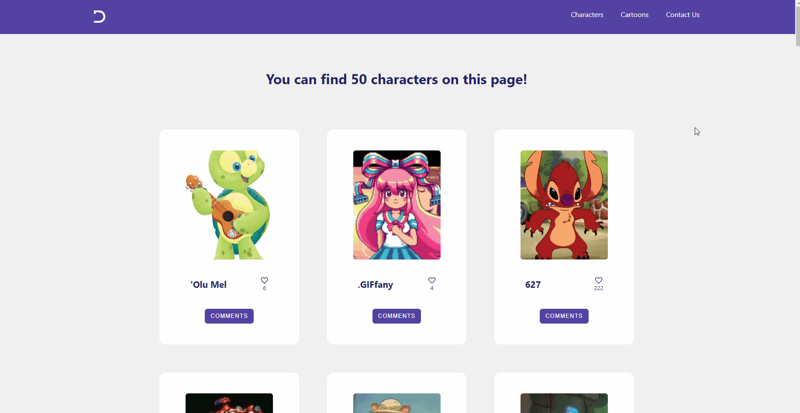
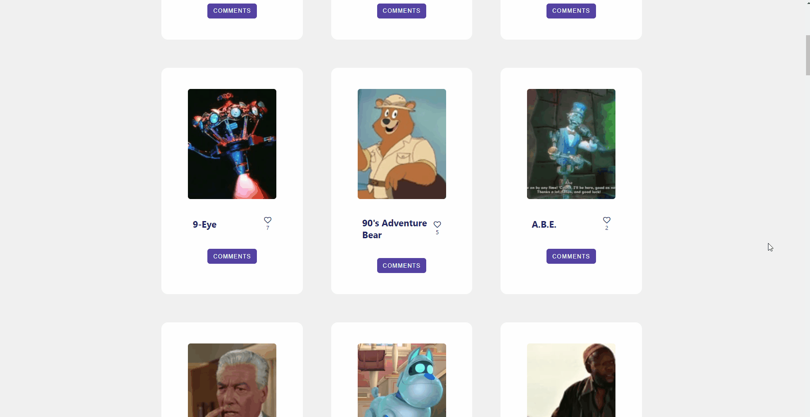

# Disney Characters API-based web app

> This project is a web app created using API and asynchronous functions in JavaScript. You can like the characters' cards and leave a nice comment in the popup by clicking on the "Comments" button.

## Built With

- HTML, CSS, JavaScript
- Webpack
- Font Awesome 5
- Jest

## Videos about this project

[Our video about this project!!](https://drive.google.com/file/d/19maUw5AoBAaNVh1vEOwYFU3fSis09zbk/view?usp=sharing)

## Live Demo

[Click here to see a live version of this app!](link-will-be-here-soon)

## Getting Started

To get a local copy up and running follow these steps:

1. Clone the project to your local machine.
2. Open the folder with your favourite IDE.
3. Enter `npm i` in the terminal
4. Enter `npm start` in the terminal

## Authors

### Author 1

- GitHub: [@abdessalem1998](https://https://github.com/abdessalem1998.com/rdnrn)
- Twitter: [HAbdssalem](https://twitter.com/HAbdssalem)

### Author 2

- GitHub: [@rdnrn](https://github.com/rdnrn)
- LinkedIn: [Nana Rodina](https://www.linkedin.com/in/arina-rodina-144612219/?locale=en_US)
- Twitter: [nana](https://twitter.com/rdnrn_nana)

## 🤝 Contributing

Contributions, issues, and feature requests are welcome!

## Show your support

Give a ⭐️ if you like this project!
